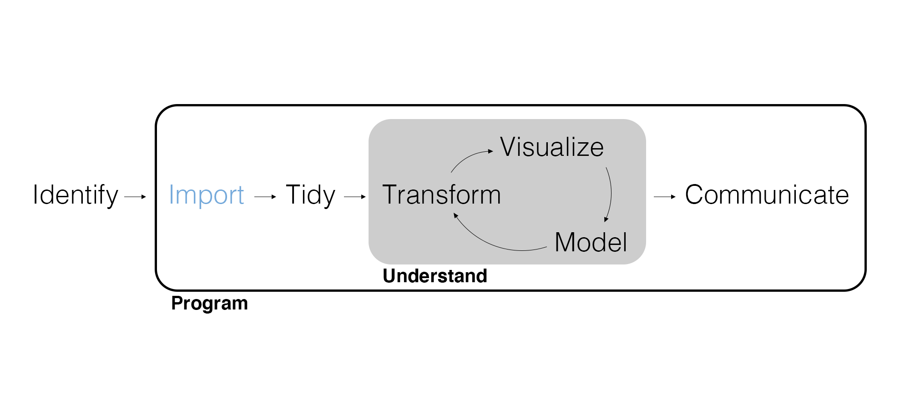
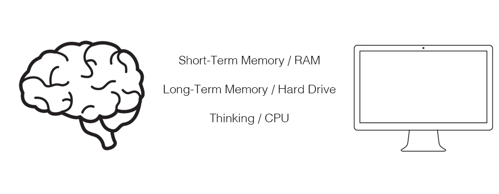
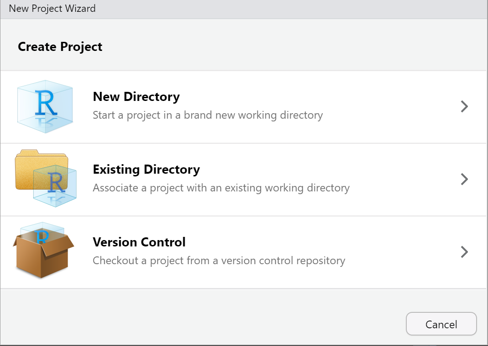
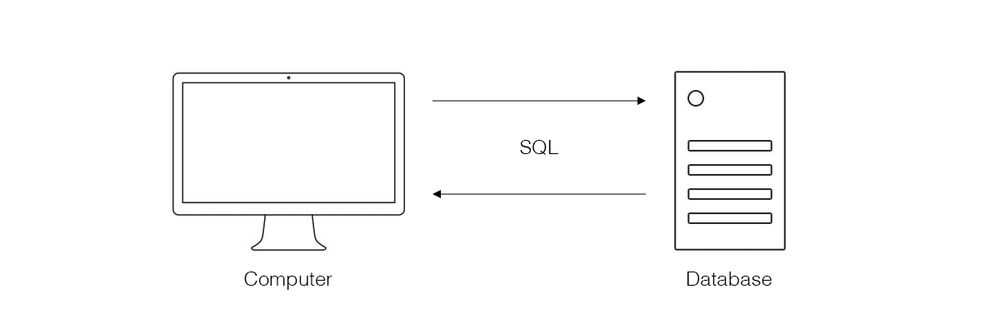

## Grading Exercises

Remember that you grade your own submitted exercises using the rubric specified in each posted exercise solution, adding comments (using the comment feature for Word documents) where your solution differs from the posted solution.

## Marketing Analytics Process

<center>
{width=900px}
</center>

---

{width=500px}

## Motivating Example

Now that you better understand how to visualize, summarize, and tidy data, your manager wants you to have more data to increase the breadth and depth of your analysis. However, this additional data is stored in a PostgreSQL database. How can you access it? Have any of you had experience with databases before?

## Computer Orientation

R's performance is primarily based on your *available* **RAM** and secondarily on your **CPU**. In RStudio, the Environment uses RAM while Files gives you access to the **hard drive**.

<center>
{width="850px"}
</center>

---

The hard drive (i.e., hard disk) is used for:

- Installing packages.
- Writing and rendering files.

RAM (i.e., random access memory) is used for:

- Loading packages.
- Importing, wrangling, visualizing, and modeling.

## Files and Folders

A hard drive is composed of **files** (e.g., .csv, .rds, .R, .qmd, .exe) organized into **folders**/**directories**. It is critical to organize your work. Create a folder for your:

- Notes
- Data
- Exercises
- Projects

Every file on your computer has a kind of address called a **file path**.

## RStudio Projects

When we want to import or save data or reference another file on the hard drive, R needs to know *where* to look. RStudio projects help organize our work.

Whenever you have this project open in RStudio, the folder/directory where the project file is will be R's **working directory**, the folder where R looks when interacting with files.

---

To create an R project, click on the blue cube with an R in it at the top left of your screen in R. You should see this box pop up, and you can either choose to start a new folder, or use an existing folder. 

<center>
{width="600px"}
</center>

---

When you initiate an R project, R creates a .Rproj file. When you open a .Rproj file, your working directory becomes the folder where the .Rproj file lives.

## Your Turn!

Take a second to organize your files for this class in the way I've just described. You may wish to create three folders within your main MKTG 411 folder, one for each unit, and then include sub-folders for notes, data, exercises, and projects within each. For future exercises and projects, starting with the one for exercise 6, include a .Rproj file in your folder to help you easily access the working directory you need.

## Databases and SQL

As the size and complexity of data grow, it is more likely to be housed on a **database**, a computer or **server** formatted specifically to house data (relational and otherwise). We communicate with a database using **queries** composed in **SQL** (Structured Query Language).

<center>
{width=850px}
</center>

## SQL Backends

There are a number of different types of databases or **backends**: MySQL, PostgreSQL, RSQLite, etc. Each backend requires its own dialect of SQL.

So we need to not only know SQL, we need to know a specific backend in order to just import data from a database.

## Simple Queries

While it probably is a good idea to learn some SQL and specific backends, for *simple queries* we can write {dplyr} code that {dbplyr} will translate into a query in a specific backend for us. These two package names are similar, but they're not to be confused. We've already worked with {dplyr}, and now we are introducing {dbplyr}.

## Install and Load Packages

Click Tools > Install Packages and type in 'RPostgreSQL' to install the R PostgreSQL backend.

```{r eval=FALSE}
library(tidyverse) # tidyverse packages, including dplyr.
library(dbplyr)    # dbplyr translates dplyr into SQL.
library(DBI)       # DBI manages the database connection.
```

## Connect to a Database

The password is `practicemakes`. It is bad form to save a password in your code.

```{r eval=FALSE}
con <- dbConnect(
  RPostgreSQL::PostgreSQL(),
  dbname = "analyticsdb",
  host = "analyticsdb.ccutuqssh92k.us-west-2.rds.amazonaws.com",
  port = 5432,
  user = "quantmktg",
  password = rstudioapi::askForPassword("Database password")
)

con
```

```
<PostgreSQLConnection>
```

## Data Tables

List the **data tables** (the database's "data frames") on the database. Large data like those stored in a CRM system typically need to be stored in separate data tables.

```{r eval=FALSE}
dbListTables(con)
```

```
[1] "customer_data" "store_revenue"
```

---

Print a data table. What's different?

```{r eval=FALSE}
tbl(con, "store_revenue")
```

```
# Source:   lazy query [?? x 9]
# Database:postgres 13.0.4 [@analyticsdb.cmpg1g9cbgai.us-east-1.rds.amazonaws.com:5432/analyticsdb]
   row.names customer_id jan_2005 feb_2005 mar_2005 apr_2005 may_2005 jun_2005 jul_2005
   <chr>           <dbl>    <dbl>    <dbl>    <dbl>    <dbl>    <dbl>    <dbl>    <dbl>
 1 1                1001       0        0        0      684.       0      580.       0 
 2 2                1002       0        0      682.       0        0        0        0 
 3 3                1003       0        0        0        0        0        0        0 
 4 4                1004       0        0        0        0        0        0        0 
 5 5                1005       0        0        0        0        0      315.       0 
 6 6                1006       0      335.       0        0        0        0        0 
 7 7                1007       0        0        0      540.       0        0        0 
 8 8                1008     382.       0        0        0        0        0      425.
 9 9                1009       0        0        0        0        0        0      841.
10 10               1010       0        0        0      252.     481.       0        0 
# … with more rows, and 161 more variables: aug_2005, <dbl>, sep_2005 <dbl>, oct_2005 <dbl>, nov_2005 <dbl>, 
#   dec_2005 <dbl>, jan_2006 <dbl>, feb_2006 <dbl>, mar_2006 <dbl>, apr_2006 <dbl>, may_2006 <dbl>, jun_2006 <dbl>, 
#   jul_2006 <dbl>, aug_2006 <dbl>, sep_2006 <dbl>, oct_2006 <dbl>, nov_2006 <dbl>, dec_2006 <dbl>, jan_2007 <dbl>, 
#   feb_2007 <dbl>, mar_2007 <dbl>, apr_2007 <dbl>, may_2007 <dbl>, jun_2007 <dbl>, jul_2007 <dbl>, ...
```

## Query a Database

It can be **computationally expensive** to query a database so {dbplyr} doesn't execute a query until you ask for data.

```{r eval=FALSE}
data_db <- tbl(con, "customer_data") |> 
  filter(region == "West") |> 
  group_by(state) |> 
  summarize(
    n = n(),
    avg_income = mean(income),
    avg_credit = mean(credit)
  )

data_db
```

```
# Source:   lazy query [?? x 4]
# Database:postgres 13.0.4 [@analyticsdb.cmpg1g9cbgai.us-east-1.rds.amazonaws.com:5432/analyticsdb]
   state     n avg_income avg_credit
   <chr> <dbl>      <dbl>      <dbl>
 1 CA      397    139882.       670.
 2 OR      400    135625        666.
 3 NV      363    143835.       670.
 4 HI      387    138917.       669.
 5 NM      421    146069.       663.
 6 ID      418    136275.       664.
 7 AK      416    138517.       662.
 8 WY      376    143394.       671.
 9 MT      394    147127.       668.
10 WA      398    142621.       670.
# … with more rows
```

---

View the SQL using `show_query()`.

```{r eval=FALSE}
data_db |>
  show_query()
```

```
<SQL>
SELECT
  "state",
  COUNT(*) AS "n",
  AVG("income") AS "avg_income",
  AVG("credit") AS "avg_credit"
FROM "customer_data"
WHERE ("region" = 'West')
GROUP BY "state"
```

## Import Data and Disconnect

Once you have the wrangled the data you need, import it using `collect()`.

```{r eval=FALSE}
store_revenue <- tbl(con, "store_revenue") |>
  collect()
```

Finally, **always disconnect** from a database when you are finished.

```{r eval=FALSE}
dbDisconnect(con)
```

```
[1] TRUE
```

## Write Data

We often only import some *subset* of a data table because it is too big to fit or work with locally. However, once we have the data we need, to avoid needing to reconnect to the database, we can write it locally.

```{r eval=FALSE}
# Write it as a CSV to use outside of R.
store_revenue |> 
  select(-row.names) |> 
  write_csv(here::here("Data", "store_revenue.csv"))

# OR write is as an RDS to use again in R.
store_revenue |> 
  select(-row.names) |> 
  write_rds(here::here("Data", "store_revenue.rds"))
```

## Wrapping Up

*Summary*

- Discussed databases.
- Used {dbplyr} to write queries and import data.

*Next Time*

- Web scraping and using APIs.

*Supplementary Material*

- *R for Data Science (2e)* Chapters 9 and 23

*Artwork by @allison_horst*

## Exercise 6

Let's return to our recency, frequency, monetary (RFM) analysis. Now we can analyze customers based on how much they have spent. Once again, *remember to sketch out what you'd like the data to look like.* In RStudio on Posit Cloud, create a new Quarto document and do the following.

1. Let's define customers who have "high monetary value" as anyone who has spent more than $25,000 total. In its own section of the report, use the `store_revenue` data to identify these customers. How many "high monetary value" customers are there?
2. In its own section of the report, report on the composition of these customers by visualizing the relationship between their total revenue, credit, gender, and marital status all in a single visualization. Report on what you discover.
3. Render the Quarto document into Word, export the Word document, and upload to Canvas.

